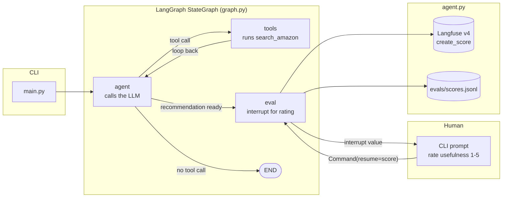

# Amazon Shopping Agent

A CLI chat agent that helps you find products on Amazon at the right price.

Describe what you want in plain English. The agent asks clarifying questions, searches Amazon, and returns the top results ranked by your goal (price, quality, or balance).

## Stack

- **Claude** (Anthropic SDK) — drives the conversation and decides when to search
- **SerpAPI** — Amazon product search (100 free searches/month)
- **Langfuse** — optional LLM observability (traces, token counts)

## Architecture

After a search, the agent pauses to ask you to rate the recommendation before continuing:



## Setup

```bash
python -m venv .venv && source .venv/bin/activate
pip install -r requirements.txt

cp .env.example .env
# Fill in SERPAPI_KEY and either GOOGLE_API_KEY or ANTHROPIC_API_KEY
```

## Run

```bash
python main.py
```

At startup you'll be prompted to choose a provider and model:
```
Provider? [1] Google (default)  [2] Anthropic :
Model? [gemini-flash-lite-latest] :
```

Press Enter to accept the defaults. Type `/model` at any time to switch mid-session.

Token usage is printed after each LLM call. Type `quit` or `exit` to stop.

## Web UI

An alternative to the CLI: a local web UI with a chat pane and a results panel that
visualizes search results as cards, a sortable table, or a price/rating chart —
whichever the agent judges best for the query.

Run the backend and frontend in two terminals:

```bash
python server.py
```

```bash
cd web
npm install   # first time only
npm run dev
```

Open the URL Vite prints (typically `http://localhost:5173`). Choose a provider/model
and click **Start** — this mirrors the CLI's startup prompt and requires the same
environment variables (see Configuration below).

Notes:
- The web UI does not support switching models mid-session (use the CLI's `/model`
  command for that).
- Responses are not streamed — the chat pane shows the full reply once the agent
  finishes, same latency profile as the CLI.
- Sessions live only in the running `server.py` process's memory; restarting it
  invalidates all open sessions (same `MemorySaver` limitation the CLI has).

## Configuration

| Variable | Required for |
|---|---|
| `GOOGLE_API_KEY` | Google provider, and the search cache's fuzzy-match judge (fixed to `gemini-flash-lite-latest` regardless of your selected provider) — [aistudio.google.com](https://aistudio.google.com/app/apikey) |
| `ANTHROPIC_API_KEY` | Anthropic provider — [console.anthropic.com](https://console.anthropic.com) |
| `SERPAPI_KEY` | Always — [serpapi.com](https://serpapi.com) (100 free searches/month) |
| `LANGFUSE_PUBLIC_KEY` | No — optional observability |
| `LANGFUSE_SECRET_KEY` | No — optional observability |
| `LANGFUSE_HOST` | No — defaults to Langfuse cloud |

## Search cache

`search_amazon` caches results locally in `~/.anz-agent/cache.db` (SQLite) to
conserve the SerpAPI free-tier quota. An exact reworded/reordered query
(e.g. "balance beam purple" vs. "purple balance beam") reuses the cache
directly; other queries are checked against past searches by a small LLM
judge (`tools/cache_judge.py`) that decides if a prior search is a close
enough match to reuse (e.g. "balance beam" reusing "purple balance beam"
results). Entries never expire — delete `~/.anz-agent/cache.db` to clear
the cache manually.

## Models

| Provider | Recommended model | Notes |
|---|---|---|
| Google | `gemini-flash-lite-latest` | Default — cheapest, tracks Google's current lite model |
| Google | `gemini-flash-latest` | Better quality |
| Anthropic | `claude-haiku-4-5-20251001` | Fast and cheap |
| Anthropic | `claude-sonnet-4-6` | Higher quality |

## Project Structure

```
anz-agent/
├── main.py          # CLI entry point — drives the graph, handles eval prompts
├── graph.py         # LangGraph StateGraph — agent/tools/eval nodes
├── agent.py         # LLM prompt/tools, Langfuse tracing, eval scoring
├── server.py        # FastAPI backend for the web UI — /session, /chat, /resume
├── tools/
│   ├── amazon.py       # SerpAPI search tool, checks the local cache first
│   ├── cache.py         # SQLite-backed search result cache (~/.anz-agent/cache.db)
│   └── cache_judge.py   # LLM subagent that fuzzy-matches queries against the cache
├── web/              # Vite/React/TypeScript frontend for the web UI
├── tests/
├── evals/           # scores.jsonl — eval ratings (gitignored)
├── .env.example
└── requirements.txt
```

## Backlog

Deferred work items live in [docs/BACKLOG.md](docs/BACKLOG.md).
