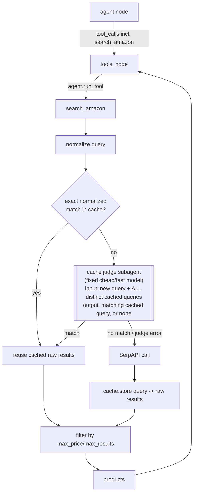

# Local search result cache — design

## Purpose

`search_amazon` (in [tools/amazon.py](../../../tools/amazon.py)) calls SerpAPI on every search, and the free tier is capped at 100 searches/month. Repeat or closely-related searches (same product, different wording, or a narrower/broader phrasing of the same thing) currently cost a fresh API call every time. This design adds a local, persistent cache that recognizes those repeats — including fuzzy/reworded matches — and reuses prior results instead of calling SerpAPI again.

## Architecture

Caching is implemented entirely inside `search_amazon`. The LangGraph graph (`graph.py`) is unaware of it — `tools_node` calls `agent.run_tool("search_amazon", ...)` exactly as it does today.



### Components

**`tools/cache.py`** (new) — the cache module:
- `normalize(query: str) -> str`: lowercase, strip punctuation, sort words. Used for the fast-path exact match (`"purple balance beam"` and `"balance beam purple"` normalize identically).
- `lookup(query: str) -> list[dict] | None`: checks for an exact normalized match first; if none, invokes the judge subagent with the new query and every distinct query currently in the cache. Returns the matched entry's raw results, or `None` on a miss (including judge errors, which are treated as a miss).
- `store(query: str, raw_results: list[dict]) -> None`: inserts a new row keyed by the raw and normalized query.

**`tools/cache_judge.py`** (new) — the judge subagent:
- A single LLM call using a fixed, cheap/fast model (independent of whatever provider/model the user selected for the conversation via `/model`) — e.g. `gemini-flash-lite-latest`.
- Prompt: given the new query and the full list of distinct cached queries, decide whether any cached query is close enough in meaning to reuse (accounting for reordering, subset/superset phrasing like `"balance beam"` vs `"purple balance beam"`, synonyms) and return that query (or none).
- Any exception (API error, malformed output) is caught and treated as "no match" — falls through to a live SerpAPI call. Caching must never break a search.

**`tools/amazon.py`** (modified) — `search_amazon` calls `cache.lookup(query)` before building SerpAPI params; on a miss, calls SerpAPI as today and then `cache.store(query, raw_results)`. `max_price`/`max_results` filtering happens after the cache lookup/store, applied identically whether results came from cache or a live call — unchanged from today's logic, since those params are never sent to SerpAPI in the first place.

### Storage

SQLite file at `~/.anz-agent/cache.db` (local to the machine, survives across CLI process restarts). Schema:

```sql
CREATE TABLE searches (
    id INTEGER PRIMARY KEY,
    query TEXT NOT NULL,
    normalized_query TEXT NOT NULL,
    raw_results TEXT NOT NULL,  -- JSON-encoded list of raw SerpAPI organic_results items
    created_at TEXT NOT NULL
);
CREATE INDEX idx_normalized_query ON searches(normalized_query);
```

`raw_results` stores the raw SerpAPI `organic_results` items (pre-filter, pre-transform) so that a cache hit can be filtered by whatever `max_price`/`max_results` the *current* call needs, independent of what the original caching call used.

No TTL/expiration — entries persist until the cache file is deleted manually.

### Error handling

- SerpAPI errors: unchanged from today (`{"error": ..., "products": []}`), and are not cached.
- Judge subagent errors (LLM call failure, unparseable response): caught and treated as a cache miss, falling through to a live SerpAPI call. A caching bug must never prevent a search from completing.
- SQLite errors (e.g. file locked, disk full): caught in `cache.lookup`/`cache.store`; on failure, `lookup` returns `None` (miss) and `store` silently no-ops. Caching is a best-effort optimization, not a correctness requirement.

### Testing

- `tests/test_cache.py` (new): unit tests for `normalize()`, exact-match hits/misses, judge-invocation on non-exact queries (with the judge mocked), and store/lookup round-tripping against a temp SQLite file.
- `tests/test_cache_judge.py` (new): tests for the judge's error handling (mocked LLM raising / returning garbage → treated as no match).
- Existing `tests/test_amazon.py` gains a case confirming `search_amazon` checks the cache before calling `GoogleSearch`, and stores results after a live call (with `tools.cache` mocked, consistent with the existing `GoogleSearch` mocking pattern in that file).

## Out of scope (backlog)

- **Candidate pre-filtering for the judge.** Currently the judge prompt includes *every* distinct query ever cached, since the cache never expires. This is fine at small scale but the prompt (and judge cost/latency) grows unboundedly with usage. A future revision should pre-filter candidates locally (e.g. shared-word heuristic) before invoking the judge. Tracked in [docs/BACKLOG.md](../../BACKLOG.md).
- Cache expiration/TTL, cache size limits, and manual cache-clearing UX (e.g. a `/clear-cache` CLI command) are not part of this design.
