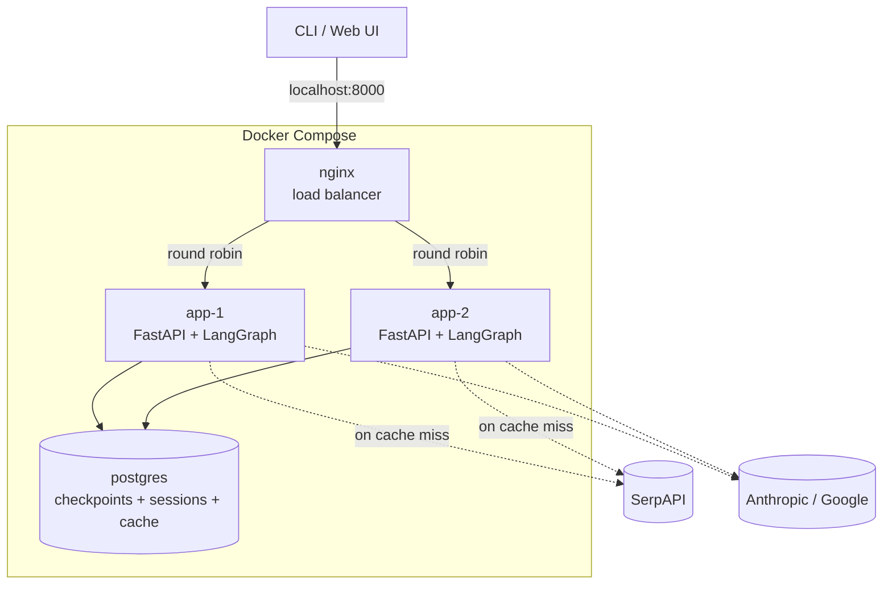

# Local Docker Compose scaling environment (Phase 1) — design

## Purpose

anz-agent currently runs as a single local process: [server.py](../../../server.py) keeps session state in an in-process dict, [graph.py](../../../graph.py) checkpoints conversation state with LangGraph's `MemorySaver` (also in-process), and [tools/cache.py](../../../tools/cache.py) caches search results in a local SQLite file. None of this survives a process restart or works across more than one replica, which blocks running this behind a load balancer with multiple app instances.

This design stands up a full-fidelity **local** environment — via Docker Compose — that fixes all of that: durable, shared state; a shared search cache; a bounded-cost cache-judge lookup; two app replicas behind a load balancer; and non-blocking request handling. The goal is to validate every piece of the scaled architecture locally, with fast iteration and no cloud account required, before deploying anywhere.

**Explicitly out of scope for this design** (tracked as future work, see bottom): deploying to a managed cloud platform, and replacing the cache-judge's LLM scan with vector similarity search.

## Architecture

One Postgres container holds three concerns as separate tables in one database: LangGraph checkpoints (item 1), a session registry (the `GraphContext` fix), and the search cache (item 2). Running one database container for local dev is simpler than three, and nothing here needs them physically separated.

### Components

**1. Postgres-backed LangGraph checkpointer.** [graph.py](../../../graph.py)'s `build_graph()` swaps `MemorySaver()` for `PostgresSaver` (`langgraph-checkpoint-postgres`), configured from a `DATABASE_URL` env var. No changes to node functions or the `interrupt()`/`Command(resume=...)` flow — the checkpointer is a drop-in swap.

**2. Session registry (replaces the `_sessions` dict / fixes the `GraphContext` gap).** `GraphContext` (`client`, `model_config`) is intentionally never checkpointed by LangGraph — it holds a live SDK client object, which isn't serializable. Today [server.py](../../../server.py)'s `_sessions: dict[str, GraphContext]` holds it in process memory, which breaks the moment a request lands on a different replica than the one that created the session.

  Fix: a small `sessions` table (`thread_id`, `provider`, `model`, `created_at`) in Postgres. `POST /session` writes a row *before* any graph invocation happens (avoiding a chicken-and-egg problem: `GraphState` doesn't exist yet to hold this on the first call). `/chat` and `/resume` read the row by `thread_id`, build a `ModelConfig`, and construct a fresh client via `llm.create_client()` — replacing the in-memory dict lookup with a per-request reconstruction that works from any replica. An unknown `thread_id` returns 404, same as today.

**3. Postgres search cache.** [tools/cache.py](../../../tools/cache.py) moves off `sqlite3` onto Postgres. Same `searches` table shape and the same `lookup()`/`store()` function signatures — [tools/amazon.py](../../../tools/amazon.py) is unaffected. `raw_results` becomes `JSONB` (was a JSON-encoded text column); `created_at` becomes `TIMESTAMPTZ`.

**4. Cache-judge candidate pre-filter.** In `lookup()`, before calling the judge subagent ([tools/cache_judge.py](../../../tools/cache_judge.py)), tokenize the new query the same way `normalize()` already does and rank cached distinct queries by shared-token overlap. Only the top ~20 candidates are sent to the judge, instead of every distinct query ever cached — bounding the judge prompt's size (and cost/latency) regardless of how large the cache grows. Ranking happens in Python for now; a Postgres trigram index (`pg_trgm`) is the natural next step if the candidate table grows into the tens of thousands of rows, but isn't needed yet.

**5. Two replicas behind a load balancer.** A single Dockerfile builds the app image; Compose runs it twice (`app-1`, `app-2`). `nginx` round-robins between them, with passive health checks (`max_fails`/`fail_timeout`) so a crashed replica is routed around automatically.

**6. Non-blocking request handling.** `/chat` and `/resume` in [server.py](../../../server.py) become `async def` and run the existing synchronous `graph.invoke()` via Starlette's `run_in_threadpool`, so one slow LLM/SerpAPI call no longer stalls the event loop for other concurrent users on the same replica. [llm.py](../../../llm.py) and [tools/amazon.py](../../../tools/amazon.py) stay synchronous — a full async rewrite of the LLM/SerpAPI call sites is deferred as a later optimization, revisited only if the thread-pool approach proves insufficient.

**7. Cache data migration.** A one-time, manually-run script, `scripts/migrate_cache_to_postgres.py`:
  - Reads every row from the existing `~/.anz-agent/cache.db` (if present)
  - Connects to the new Postgres cache table via `DATABASE_URL`
  - Inserts `query`, `normalized_query`, `raw_results` (JSON string → `JSONB`), `created_at` (parsed → `TIMESTAMPTZ`)
  - Idempotent: `ON CONFLICT (normalized_query) DO NOTHING`, safe to re-run
  - Drops the old SQLite auto-increment `id` — nothing in the codebase references cache rows by id, only by query text

  Run from the host (not inside a container) against Compose's Postgres, which needs its port exposed to `localhost`. This preserves the existing cache instead of re-burning SerpAPI's 100-searches/month free tier re-fetching things already cached.

### Data flow (one `/chat` request)

Client → `nginx` (round robin) → `app-1` or `app-2` → `run_in_threadpool(graph.invoke, ...)` → `agent_node` reads/writes checkpoint state in Postgres → on a tool call, `tools_node` → `search_amazon` → cache lookup in Postgres (pre-filtered judge call on a near-miss) → SerpAPI on a true miss → response streamed back through the same replica → `nginx` → client.

### Error handling

- **Cache fails open.** Any Postgres error during cache `lookup`/`store` is caught and treated as a miss — falls through to a live SerpAPI call, same as today's SQLite behavior. A cache outage should never break a search.
- **Checkpointer fails loud.** A Postgres error while reading/writing checkpoint state surfaces as a request error (500) rather than silently resuming with empty state — a silent reset would be more confusing than an explicit failure, since it looks like the agent forgot the conversation.
- **Session lookup miss** (unknown or missing `thread_id` row) returns 404, matching today's `_get_context()` behavior.
- **Session creation failure** (the `sessions` table write in `POST /session` errors) surfaces immediately as a request error, rather than handing back a `thread_id` the app can never actually load.
- **Replica failure** is handled by `nginx`'s passive health checks, not application code.

### Testing

- Existing unit tests are unaffected: the checkpointer/cache backend stays selectable via `DATABASE_URL` — unset (the default for plain `pytest` runs) falls back to today's `MemorySaver`/SQLite, so the existing suite stays fast and needs no Docker or Postgres running.
- New integration tests for the Postgres-backed paths (checkpointer, cache, session registry, pre-filter ranking) use `testcontainers-python` to spin up a throwaway Postgres container scoped to that test file — no manual Compose step required to run tests.
- New unit tests for the pre-filter ranking function (token overlap, shortlist size) against a fixed candidate list, independent of the judge itself (already mocked in `tests/test_cache_judge.py`).
- New test for the migration script: seed a temp SQLite file, run the migration against a `testcontainers` Postgres, assert row-for-row equivalence and idempotency on a second run.

## Out of scope (future work)

- **Phase 2 — managed cloud deploy.** Once this environment is validated locally, the next iteration deploys it to a managed container platform (Fly.io is the current leaning) instead of self-hosting. Replica count and load balancing become platform-native config rather than a self-managed `nginx` container. Gets its own design doc when that work starts.
- **Vector similarity search for the cache judge.** The pre-filter shortlist (item 4 above) bounds the judge's cost/latency for now. Replacing the LLM judge scan entirely with embedding-based similarity search remains a future iteration — deferred specifically because it introduces a new dependency (an embedding source) that doesn't have a clear low-effort local answer yet. Tracked in [docs/BACKLOG.md](../../BACKLOG.md).
- Full async rewrite of `llm.py`/`tools/amazon.py` (see component 6) — only worth doing if the thread-pool approach turns out to be insufficient in practice.
