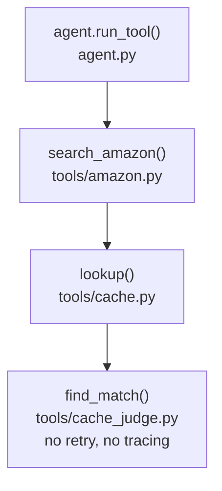
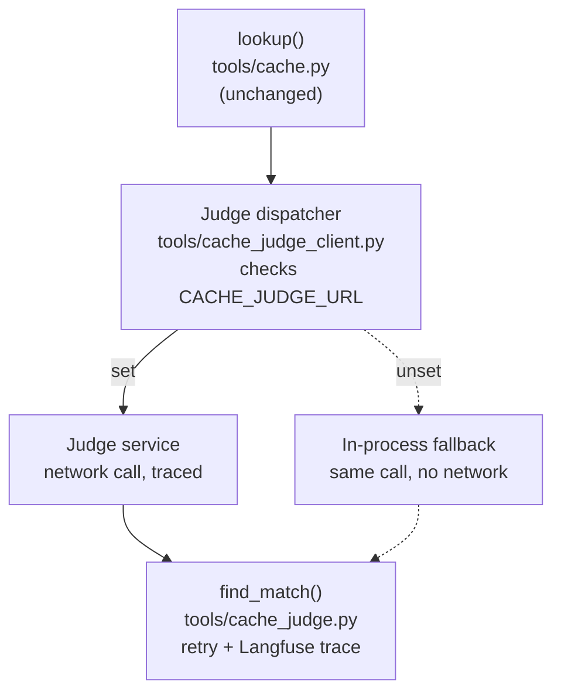
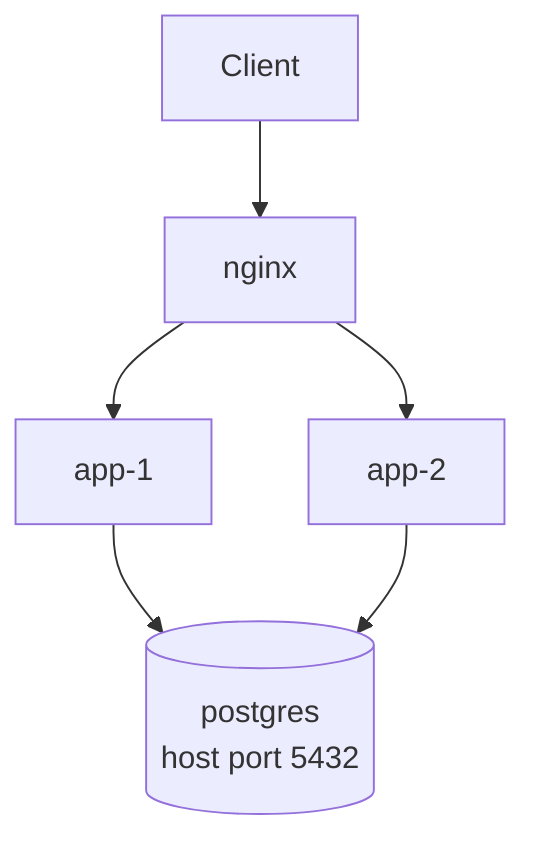
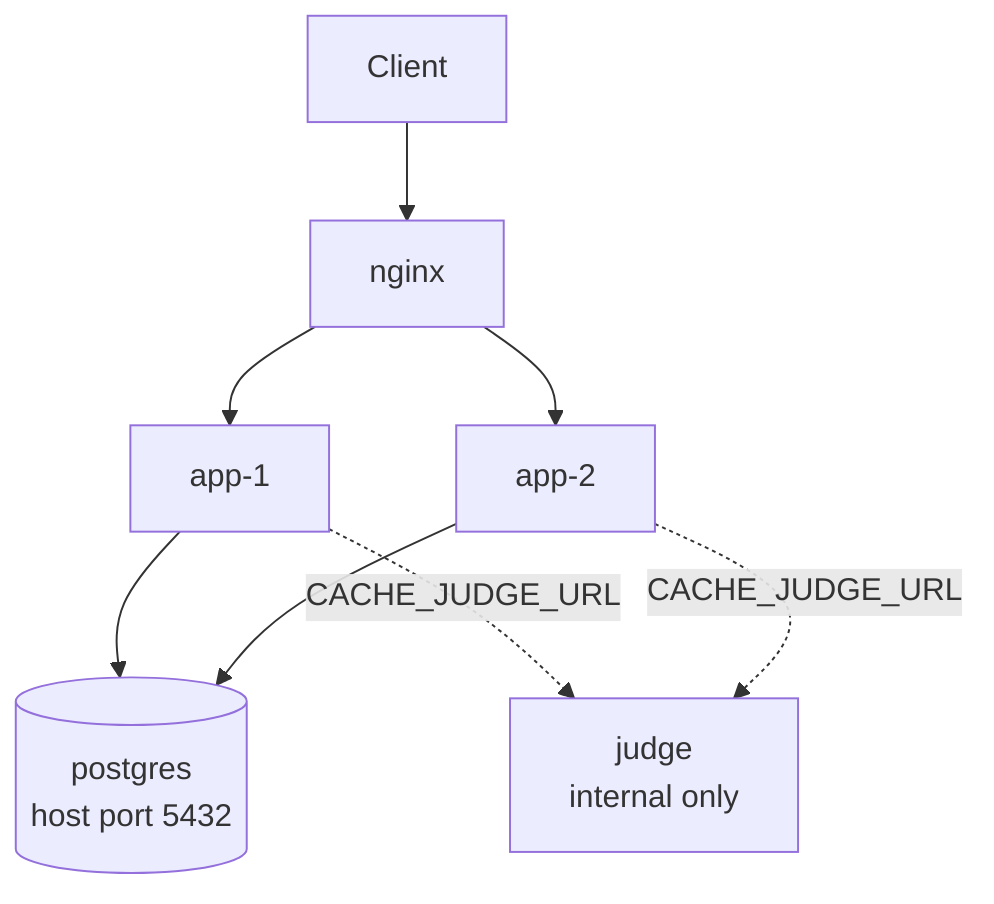

# Cache-judge agent boundary (Phase 1) — design

**Date:** 2026-08-08
**Status:** Draft — pending final review

## Purpose

`tools/cache_judge.py`'s `find_match()` is the only judge/agent-like component in this codebase that doesn't get first-class treatment: no retry, no tracing, a bare `str | None` return, a swallow-everything `except`. `agent.py`'s `judge_recommendation()` / `graph.py`'s `judge_node` set the bar this should meet: structured result, 2-attempt retry, Langfuse visibility.

This design does two things, deliberately in one pass rather than two:

1. **Brings the judge logic up to that bar** — retry, a structured `CacheMatch` result, Langfuse tracing — while it's still just a Python function.
2. **Extracts it into a standalone, network-invoked service**, gated behind an env var that doubles as a rollback lever (a "low-risk canary" for the network-hop pattern itself), *without* yet involving AWS. Deploying this same standalone service onto AWS Bedrock AgentCore Runtime is explicitly **out of scope** here — see [Out of scope](#out-of-scope--backlog) — but this design produces the exact seam that phase would reuse.

## Architecture

### Call chain — before and after



*Before: everything in-process, one straight line, no visibility when it fails silently.*



*After: `cache.lookup()` is untouched; everything below it forks on `CACHE_JUDGE_URL`, then converges back on the same judge logic. `agent.run_tool()` and `search_amazon()` are unaffected and omitted here.*

### Deployment topology — before and after





Only `nginx` exposes a host port (8000) in either version. `postgres` exposes 5432 to localhost only for `scripts/migrate_cache_to_postgres.py`. The new `judge` container exposes nothing to the host — same trust level as `app-1`/`app-2`, reachable only from inside the Compose network.

**The canary mechanism is `CACHE_JUDGE_URL`.** Unset → `cache_judge_client.find_match()` calls `tools.cache_judge.find_match()` directly — byte-for-byte today's (post-cleanup) behavior, zero risk regression for `main.py`, plain `uvicorn server:app`, and the entire existing test suite, none of which set this var. Set (in `docker-compose.yml`) → it POSTs to the standalone service instead. Flipping it is the entire rollback lever: no image changes, no data migration, nothing stateful to unwind.

**What "in-process fallback" actually runs.** It is not a degraded path — it is the literal same `find_match()` function, including its own outbound call to the judge LLM (`gemini-flash-lite-latest`) over the network, its own 2-attempt retry, and its own Langfuse tracing. The only thing that differs between the two paths is *where that function executes* (inside `app-1`/`app-2`'s own process vs. inside the separate `judge` container, reached via one HTTP hop). Judge quality, retry behavior, and tracing are identical either way.

## Components

### 1. `tools/cache_judge.py` — judge logic (core change)

```python
@dataclass
class CacheMatch:
    matched_query: str | None   # cached query text if judge found a match, else None
    outcome: str                 # "matched" | "no_match" | "error"

def find_match(query: str, candidates: list[str], trace_id: str | None = None) -> CacheMatch:
```

- No candidates → `CacheMatch(None, "no_match")`, no LLM call, no span (unchanged fast path).
- Otherwise: up to **2 attempts** (matching `judge_recommendation`'s retry count). An attempt is retried when the LLM call raises, **or** when the answer is neither `"NONE"` nor an exact candidate string — a hallucinated/malformed answer is treated the same way `judge_recommendation` treats unparseable JSON: a deviation from the expected response shape, worth one retry, not an automatic terminal failure. Attempts exhausted with no valid answer → `CacheMatch(None, "error")`.
- A literal `"NONE"` answer is a **successful** judge decision, not a failure → `CacheMatch(None, "no_match")`, not retried.
- Model/prompt (`JUDGE_MODEL_CONFIG`, `SYSTEM_PROMPT`, the fixed `gemini-flash-lite-latest`) stay exactly as-is — no change to judge behavior, only to the harness around it.

**Tracing**: when `trace_id` is given, `find_match` opens a Langfuse `generation` observation (same mechanism `agent_node` uses for the main chat call: `start_observation(trace_context={"trace_id": ...}, name="cache_judge", as_type="generation", input=..., model=...)`), recording the query/candidates in and the verdict (`matched_query`, `outcome`, attempt count) out. It lands in the same trace as `run_tool`'s existing `search_amazon` tool span, as a sibling observation. Span create/update/end are each wrapped in their own try/except, fail-open — a Langfuse outage must never break a cache lookup. This is **not** a `create_score()` call like the LLM-judge uses — there's no human score to pair against, and a generation observation carries far more diagnostic value (actual prompt/candidates/verdict) than a pass/fail score would.

### 2. `tracing.py` (new, repo root) — shared Langfuse client singleton

```python
def get_langfuse() -> Langfuse: ...
```

Lifted verbatim out of `agent.py`'s private `_get_langfuse()`. `agent.py` becomes `from tracing import get_langfuse as _get_langfuse` — zero behavior change, zero call-site changes needed in `graph.py` (which calls `agent._get_langfuse()` today and keeps doing so). `cache_judge.py` imports the same `get_langfuse`. This is a straight dedup, **not** a provider abstraction — call sites still use the Langfuse SDK directly (`start_observation`, `create_score`, etc.). A real provider-neutral facade is explicitly deferred (see backlog).

### 3. `tools/cache_judge_client.py` (new) — the dispatcher

Same name, same signature as `cache_judge.find_match()` — deliberately, so `tools/cache.py`'s import target is a one-line swap (`from tools.cache_judge_client import find_match` instead of `from tools.cache_judge import find_match`) rather than a call-site rewrite. Reads `CACHE_JUDGE_URL` once:

- **Unset** → calls `tools.cache_judge.find_match()` directly.
- **Set** → POSTs `{query, candidates, trace_id}` via a module-level `httpx.Client` singleton (mirrors the `_client`/`_langfuse` singleton pattern already used in this codebase), **15s timeout** (generous enough to cover the service's own 2 internal LLM attempts), **no additional HTTP-level retry** — the service already retries the LLM call; retrying the whole HTTP call on top would risk up to 4 LLM attempts for one cache lookup. Any failure (timeout, connection error, non-2xx, malformed JSON) is caught and fails open to `CacheMatch(None, "error")` — it never falls back to calling `cache_judge.find_match()` in-process on network failure, which would silently blur the canary signal (you'd lose the ability to tell from Langfuse whether the network path is actually being exercised).

**On duplication**: this branching is real — two ways to reach one function, each needing its own tests and error handling — but it isn't new complexity, it mirrors `tools/cache.py`'s existing `_using_postgres()` dispatch between SQLite and Postgres. It's also not optional ornamentation: without the in-process branch, `main.py`'s no-Docker CLI workflow would require the `judge` service to be separately running just to search Amazon at all.

### 4. `judge_service.py` (new, repo root) — the standalone service

Thin FastAPI app, one endpoint: `POST /match` — body `{query, candidates, trace_id}`, calls `tools.cache_judge.find_match()` directly, returns `{matched_query, outcome}`. No DB access, no other endpoints, no state. `find_match()` is already exception-safe by its own contract (never raises, fails inward to `outcome="error"`), so the endpoint doesn't need its own defensive try/except beyond what FastAPI/pydantic already provide for request validation.

Deployed with the **same** `Dockerfile`, different `CMD` — no new image to build, version, or maintain. `docker-compose.yml`'s `judge` service is `build: .` (identical build step to `app-1`/`app-2`) with `command: ["uvicorn", "judge_service:app", "--host", "0.0.0.0", "--port", "8001"]` overriding the Dockerfile's default `CMD`. This does mean the `judge` container ships the *entire* app codebase (`agent.py`, `graph.py`, `server.py`, etc.) even though it only ever exercises `judge_service.py` + `tools/cache_judge.py` + `tracing.py` — dead weight, not duplication, and a deliberate trade for a v1 canary (one image to build and reason about, not two).

### 5. Signature threading through the existing call chain

`trace_id` has to reach `cache_judge_client.find_match()` from somewhere — it's plumbed through every call site on the path:

- `agent.run_tool()` — already has `trace_id` (used for its own `search_amazon` tool span); changes its call from `search_amazon(**tool_input)` to `search_amazon(**tool_input, trace_id=trace_id)`.
- `tools/amazon.py`'s `search_amazon(..., trace_id=None)` — forwards to `cache.lookup(query, trace_id=trace_id)`.
- `tools/cache.py`'s `lookup(query, trace_id=None)`, `_lookup_sqlite(query, trace_id)`, `_lookup_postgres(query, trace_id)` — each passes `trace_id` down to `cache_judge_client.find_match(query, shortlist, trace_id=trace_id)` and reads `match.matched_query` instead of today's bare string.

`cache.store()` is **not** touched — it never calls the judge, so a `trace_id` parameter there would be unused plumbing.

### 6. `docker-compose.yml` changes

- New `judge` service: `build: .`, overridden `command`, `env_file: .env` (needs `GOOGLE_API_KEY`/`LANGFUSE_*`, same as the app containers), **no `ports:` entry** — internal-Compose-network-only, same trust level as `postgres`.
- `app-1`/`app-2` gain `CACHE_JUDGE_URL: http://judge:8001/match` — resolves via Compose's built-in service-name DNS, no manual network wiring.
- No auth between `app-*` and `judge` for v1 — see [Out of scope](#out-of-scope--backlog) for the reasoning and the plan for if/when this needs to change.

## Error handling

| Scenario | Behavior |
|---|---|
| No candidates | `CacheMatch(None, "no_match")`, no LLM call, no span |
| Judge LLM call raises | Retry once (2 attempts total) |
| Answer is malformed/hallucinated (not `"NONE"`, not a candidate) | Retry once, same budget as above |
| Both attempts fail | `CacheMatch(None, "error")` |
| `CACHE_JUDGE_URL` unset | In-process call, unchanged |
| Judge service unreachable / times out / returns non-2xx / bad JSON | Fail open → `CacheMatch(None, "error")` |
| Langfuse span create/update/end raises | Caught locally, ignored — judge result unaffected |

In every failure case, `cache.lookup()` treats the result identically to an explicit "no match": falls through to a live SerpAPI search. Cache-judge failure — at the LLM level, the network level, or the tracing level — must never break search. This preserves today's fail-open guarantee end-to-end (already enforced again at `cache.lookup()`'s own outer try/except) while adding retry and visibility around the judge step specifically.

## Testing

- `tests/test_cache_judge.py`: update existing tests for the `CacheMatch` return shape; add — retry-then-succeed on a transient exception, retry-then-succeed on a malformed first answer, both attempts fail → `outcome="error"`, literal `"NONE"` → `outcome="no_match"` without retry, Langfuse generation opened/updated/ended with `trace_id` (mocked `tracing.get_langfuse`), no span when `trace_id` is `None`, span-creation failure doesn't break the result (fail-open).
- `tests/test_cache_judge_client.py` (new): mocked `httpx` — dispatch-to-network-when-set, dispatch-to-in-process-when-unset (mocking `tools.cache_judge.find_match`), fail-open on timeout/connection-error/non-2xx/bad-JSON, `trace_id` forwarded in the payload.
- `tests/test_judge_service.py` (new): FastAPI `TestClient` against `/match`, mocked `cache_judge.find_match`, verifies request/response shape.
- `tests/test_cache.py`: mock target moves from `tools.cache_judge.find_match` to `tools.cache_judge_client.find_match`; verify `trace_id` forwarding through `lookup()`.
- `tests/test_amazon.py`: verify `trace_id` forwarding through `search_amazon()`.
- `tests/test_agent.py`: update `test_run_tool_search_amazon` to assert `trace_id` is forwarded to `search_amazon`.
- New small test (folded into `test_agent.py` or its own module) for `tracing.get_langfuse()`'s singleton behavior.
- No `testcontainers`-style integration test needed for the network hop (unlike Postgres) — the contract is fully exercised by the client-side and service-side unit tests independently. CI never sets `CACHE_JUDGE_URL`, so the existing suite stays Docker-free.

## Out of scope / backlog

- **AWS Bedrock AgentCore hosting** (the actual phase 2). `judge_service.py`'s `/match` endpoint gets replaced by the AgentCore SDK's `@app.entrypoint` wrapper; `tools/cache_judge.py`'s logic is unchanged; `cache_judge_client.py` swaps its `httpx` POST for a `boto3` `invoke_agent_runtime` call. That client-side swap is real work, not free — noted explicitly rather than implied away. AgentCore's own invocation auth (AWS IAM on `invoke_agent_runtime`) supersedes the network-boundary question below once this happens.
- **Service-to-service auth for `app-* → judge`.** None for v1 — same-Compose-network trust, no host port on `judge`, matching `postgres`'s existing trust model. **If `judge` is ever deployed to separate infrastructure before AgentCore** (a machine or VPC of its own, not yet AgentCore), the plan is: restrict `judge`'s security group to accept inbound only from the app tier's security group (not from a token or shared secret). This is deliberately a network-boundary control, not an application-level one — AWS security-group-based source restriction is enforced at the ENI level and isn't spoofable the way a shared bearer token can leak or be stolen, and the data at stake (a search query string and a shortlist of cached queries) doesn't warrant heavier machinery like mTLS. This becomes moot the moment AgentCore is in the picture, since IAM handles that authorization instead.
- **Provider-neutral tracing facade.** Wrapping Langfuse's `start_observation`/`create_score`/etc. behind our own functions so a provider swap only touches one module. Explicitly deferred — nothing today plans a provider swap, and building it now would be speculative abstraction.
- **HTTP-layer retry-on-transience** for `cache_judge_client.py`. Deliberately skipped for v1 — a Docker Compose bridge network doesn't exhibit the transient failures that make client-side retry worthwhile; revisit if real flakiness shows up in practice.
- **Separate minimal image for `judge`.** Reusing the app's full image is a deliberate v1 simplicity trade (one image to build, not two); a leaner image that only ships what `judge_service.py` needs would trim dead weight at the cost of a second image to build/version.
- Fuzzy-match alias persistence and vector-similarity search for the cache — already tracked in `docs/BACKLOG.md`, untouched by this pass.
